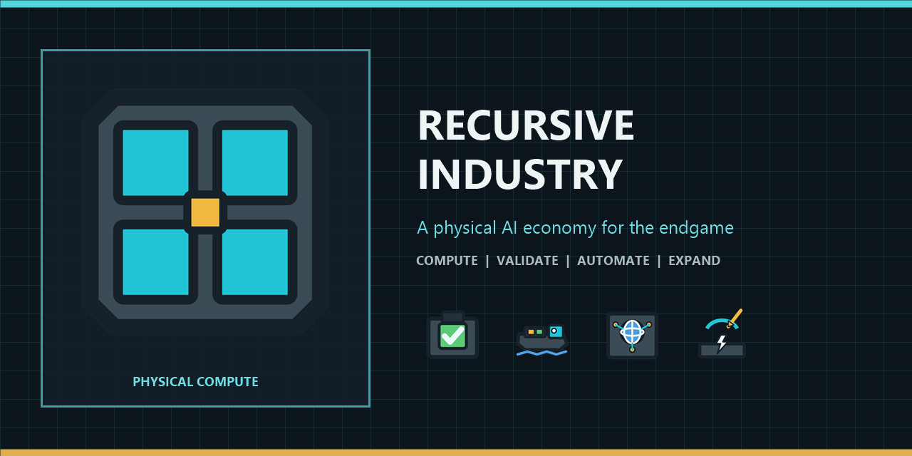

# Recursive Industry

[](https://github.com/johnkord/CoI-RecursiveIndustry/actions/workflows/validate.yml)



**Build intelligence into the factory, then decide where its finite capacity should go.**

Recursive Industry is a Captain of Industry endgame mod about building a physical
AI economy, from accelerator racks and validated models to autonomous industry,
planetary coordination, and frontier-scale megaprojects.

> **Development status:** Version 0.22.0b is the current public playtest.
> Its gameplay is identical to the author-reviewed 0.22.0a build. Migration from older
> pre-release saves is unsupported; start a new campaign. Stable 1.0 still
> requires clean fresh-world and independent evidence.

[Download Recursive Industry 0.22.0b Playtest](https://github.com/johnkord/CoI-RecursiveIndustry/releases/tag/v0.22.0b)

Player ZIP SHA-256:
`1199B108737A431C9339B285C815C08B026F0A5FBAC64F5D9813B819E4E2293F`

## What it adds

- Three accelerator-rack generations for vanilla Data Centers.
- Physical Dataset Archives, Model Archives, Validated Control Packages,
  Experiment Programs, Research Dossiers, and Frontier Programs.
- AI Operations offices that turn workers, Computing, and renewable control into
  allocatable Focus.
- Applied Science that keeps physical experiments and validation relevant.
- Autonomous freight, heavy equipment, forestry, and a full locomotive roster
  built on native game behavior.
- Planetary coordination, bounded world contracts, orbital science, and
  Dossier-fed orbital power.
- Nineteen specialized high-power megafacilities covering materials, refining,
  chemistry, food, utilities, nuclear fuel, and advanced manufacturing.
- Direct, Integrated, and Precision production choices. Precision preserves
  throughput while reducing feedstock by 12.5% at twice the energy per output.
- A Data-only Fiber control plane. Direct production remains Fiber-free, while
  twenty-four cross-stage compositions on eleven owners require live Industrial
  Control Stream from Control Deployment Gateways. Twenty-one are universal
  catalog modes and three remain on earlier specialist facilities. Precision
  efficiency remains Fiber-free and pays through 200% recipe power.
- Federated Deployment for endgame density: Backbone-rate Gateway operation and
  a long-batch Assurance Campus preserve exact Package and Stream yields while
  trading additional power, Computing, capital, and cadence for fewer buildings.
- Five directed refinery slates convert crude into Diesel, Fuel Gas plus
  Hydrogen, deep Hydrogen, Plastic, or Rubber without exporting Heavy, Medium,
  or Light Oil or Naphtha. They retain Sour Water, CO2, Exhaust, Water, and gas
  residuals and require continuous Stream.
- A production-scale Electronics III Direct row on the late Precision Components
  Fab.
- Stream-controlled raw Electronics III and Lab Equipment II through IV rows,
  while local Electronics, Microchips, staged capital, Precision, and Nexus
  production no longer burn a Package every batch.
- Precision Irrigation and two native in-place farm upgrades: Greenhouse II to
  Sensor-Guided Greenhouse, and Chicken Farm to Monitored Poultry Farm. They
  reduce labor while preserving entity identity, biological state, inputs,
  outputs, schedules, weather, and player controls.
- Four exact Stream-free agrifood rows convert milling and oilseed coproducts
  into formulated Eggs, cultured Meat, mycoprotein Trimmings, or Companion
  Provisions without deleting Oxygen, water, power, or residual obligations.
- An optional staffed Companion Animal Center turns packaged provisions into a
  bounded 0.6-Unity settlement service while returning Waste. It grants no
  Health or worker-productivity bonus.
- A bounded reinvestment finale: Frontier Projects can accelerate future Programs
  or expand autonomous construction-capital production.

The mod deliberately preserves conventional machines, material conservation,
power demand, maintenance, logistics, validation, and selected human work. It is
not a global speed multiplier or a free-resource automation mod.

## Requirements

- Captain of Industry 0.8.7, verified on Build 613.
- Trains expansion 1.0.0 or newer.
- Supporter edition 1.1.0 is optional and enables the Captain's locomotive variant.
- Start a new campaign with the mod enabled. Adding or removing it from an
  existing save is unsupported.

## Installation

For the current playtest:

1. Download `RecursiveIndustry-0.22.0b.zip` from the
  [GitHub pre-release](https://github.com/johnkord/CoI-RecursiveIndustry/releases/tag/v0.22.0b).
2. Extract it into `%APPDATA%/Captain of Industry/Mods`.
3. Confirm the resulting path is
   `%APPDATA%/Captain of Industry/Mods/RecursiveIndustry/manifest.json`.
4. Enable Recursive Industry when creating a new campaign.

Do not install source-code archives from GitHub's automatic **Source code** links;
use the packaged mod ZIP attached to a release.

## Building from source

Building requires Windows and a lawfully installed copy of Captain of Industry.
Set `COI_ROOT` to the game directory, then run:

```powershell
$env:COI_ROOT = "C:\Program Files (x86)\Steam\steamapps\common\Captain of Industry"
dotnet build mods/RecursiveIndustry/RecursiveIndustry.csproj -c Release
python tools/package_mod.py mods/RecursiveIndustry
python tools/audit_release_zip.py
```

The Release build deploys to `%APPDATA%/Captain of Industry/Mods/RecursiveIndustry`
by default. Set `/p:DeployToModsFolder=false` to build without deploying.

Run the public offline checks with:

```powershell
python tools/validate_public_repo.py
python tools/audit_recursive_industry_control_network.py
python tools/generate_recursive_industry_universal_source.py
python -m unittest discover -s tests -p "test_*.py"
```

Inspect the selected support economy or its terrestrial-grid counterfactual with:

```powershell
python tools/simulate_recursive_industry_economy.py
python tools/simulate_recursive_industry_economy.py --power-basis terrestrial
```

The JSON report also includes six Industrial Control topologies, Package density
comparators, the 12-point Gateway sensitivity tournament, and representative
Electronics III supply closure.

Game assemblies are referenced from `COI_ROOT` and must never be committed or
redistributed.

## Documentation

- [Design](docs/DESIGN.md)
- [Progression](docs/PROGRESSION.md)
- [Balance](docs/BALANCE.md)
- [Adaptive Agrifood](docs/AGRIFOOD.md)
- [Architecture](docs/ARCHITECTURE.md)
- [Building and packaging](docs/BUILDING.md)
- [Compatibility](docs/COMPATIBILITY.md)
- [Verification](docs/VERIFICATION.md)
- [Playtesting](docs/PLAYTESTING.md)
- [Roadmap](docs/ROADMAP.md)

## Contributing and support

Use GitHub Issues for reproducible bugs and bounded feature proposals. Read
[CONTRIBUTING.md](CONTRIBUTING.md) before submitting code or assets. Report
security-sensitive issues privately as described in [SECURITY.md](SECURITY.md).

## License and policy

Recursive Industry is available under
[COI-Open Version 1.0](LICENSE). See [NOTICE.md](NOTICE.md) for the required game-code
reference notice and intellectual-property boundary.

The mod includes no game DLLs, unmodified game assets, telemetry, or network
connections. Captain of Industry and related intellectual property belong to MaFi
Games. This project is not endorsed by MaFi Games.
